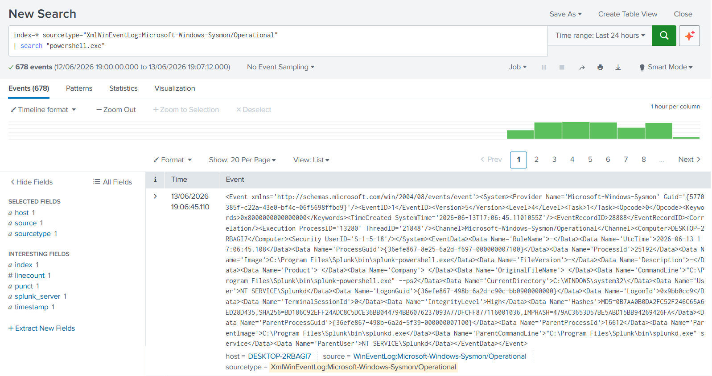
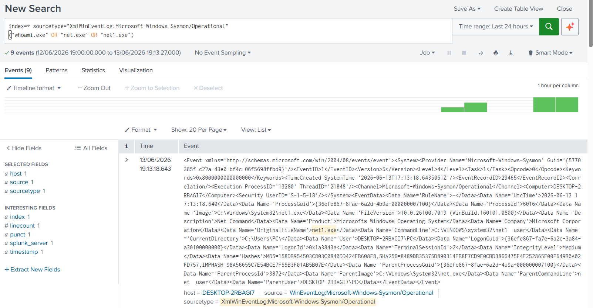
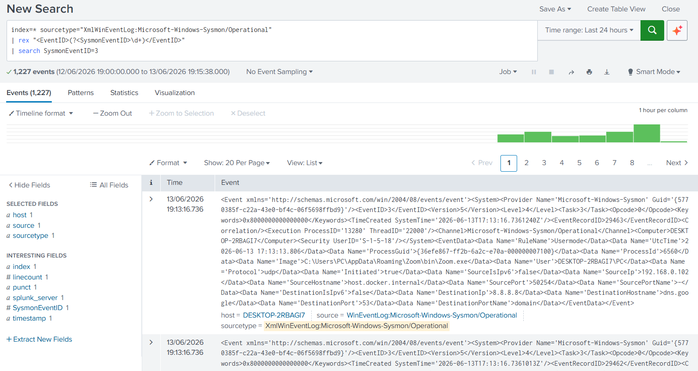
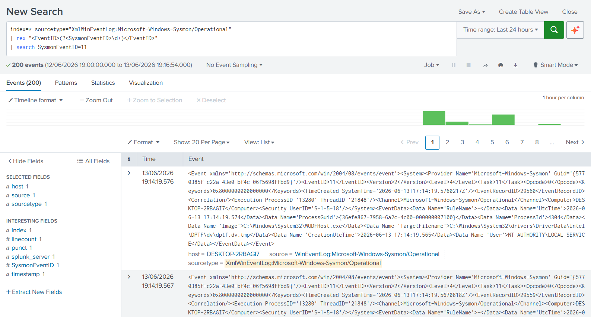

# Sigma Detection Lab

## Overview

This project demonstrates detection engineering using Sigma-style rules, Splunk SPL queries, Sysmon telemetry, and MITRE ATT&CK mapping.

The goal of this lab is to create detection logic, convert it into Splunk SPL searches, and validate detections using Windows Sysmon logs collected in Splunk.

---

## Environment

| Component | Details |
|----------|---------|
| SIEM | Splunk Enterprise 10.4 |
| Endpoint | Windows 11 |
| Telemetry | Sysmon |
| Log Source | Microsoft-Windows-Sysmon/Operational |
| Sourcetype | XmlWinEventLog:Microsoft-Windows-Sysmon/Operational |

---

## Detection Coverage

| Detection | MITRE ATT&CK | Status |
|----------|--------------|--------|
| PowerShell Execution | T1059.001 | Completed |
| Command Prompt Execution | T1059.003 | Completed |
| Account Discovery | T1087 | Completed |
| Network Connections | T1049 | Completed |
| File Creation Activity | T1105 | Completed |

---

# Detection 1: PowerShell Execution

## Sigma Rule

```yaml
title: PowerShell Execution
id: sigma-powershell-execution
status: experimental
description: Detects PowerShell execution using Sysmon process creation telemetry.
logsource:
  product: windows
  service: sysmon
detection:
  selection:
    Image|endswith: '\powershell.exe'
  condition: selection
level: medium
tags:
  - attack.execution
  - attack.t1059.001
```

## Splunk SPL Query

```spl
index=* sourcetype="XmlWinEventLog:Microsoft-Windows-Sysmon/Operational"
| search "powershell.exe"
```

## MITRE ATT&CK

T1059.001 - PowerShell

## Detection Result

PowerShell execution was detected in Splunk using Sysmon telemetry.



---

# Detection 2: Command Prompt Execution

## Sigma Rule

```yaml
title: Command Prompt Execution
id: sigma-cmd-execution
status: experimental
description: Detects execution of Windows Command Prompt.
logsource:
  product: windows
  service: sysmon
detection:
  selection:
    Image|endswith: '\cmd.exe'
  condition: selection
level: medium
tags:
  - attack.execution
  - attack.t1059.003
```

## Splunk SPL Query

```spl
index=* sourcetype="XmlWinEventLog:Microsoft-Windows-Sysmon/Operational"
| search "cmd.exe"
```

## MITRE ATT&CK

T1059.003 - Windows Command Shell

## Detection Result

Command Prompt execution was detected using Sysmon process creation telemetry.


---

# Detection 3: Account Discovery

## Sigma Rule

```yaml
title: Account Discovery
id: sigma-account-discovery
status: experimental
description: Detects account discovery commands such as whoami and net user.
logsource:
  product: windows
  service: sysmon
detection:
  selection:
    Image|endswith:
      - '\whoami.exe'
      - '\net.exe'
      - '\net1.exe'
  condition: selection
level: medium
tags:
  - attack.discovery
  - attack.t1087
```

## Splunk SPL Query

```spl
index=* sourcetype="XmlWinEventLog:Microsoft-Windows-Sysmon/Operational"
("whoami.exe" OR "net.exe" OR "net1.exe")
```

## MITRE ATT&CK

T1087 - Account Discovery

## Detection Result

Account discovery activity was detected using Sysmon process creation telemetry.



---

# Detection 4: Network Connections

## Sigma Rule

```yaml
title: Network Connection Activity
id: sigma-network-connections
status: experimental
description: Detects Sysmon network connection events.
logsource:
  product: windows
  service: sysmon
detection:
  selection:
    EventID: 3
  condition: selection
level: low
tags:
  - attack.discovery
  - attack.t1049
```

## Splunk SPL Query

```spl
index=* sourcetype="XmlWinEventLog:Microsoft-Windows-Sysmon/Operational"
| rex "<EventID>(?<SysmonEventID>\d+)</EventID>"
| search SysmonEventID=3
```

## MITRE ATT&CK

T1049 - System Network Connections Discovery

## Detection Result

Network connection events were detected using Sysmon telemetry.



---

# Detection 5: File Creation Activity

## Sigma Rule

```yaml
title: File Creation Activity
id: sigma-file-creation-activity
status: experimental
description: Detects file creation activity using Sysmon Event ID 11.
logsource:
  product: windows
  service: sysmon
detection:
  selection:
    EventID: 11
  condition: selection
level: low
tags:
  - attack.command-and-control
  - attack.t1105
```

## Splunk SPL Query

```spl
index=* sourcetype="XmlWinEventLog:Microsoft-Windows-Sysmon/Operational"
| rex "<EventID>(?<SysmonEventID>\d+)</EventID>"
| search SysmonEventID=11
```

## MITRE ATT&CK

T1105 - Ingress Tool Transfer

## Detection Result

File creation activity was detected using Sysmon telemetry.



---
## Hunt 5 - File Creation Activity

### Objective

Identify file creation events using Sysmon Event ID 11.

### Splunk Query

```spl
index=* sourcetype="XmlWinEventLog:Microsoft-Windows-Sysmon/Operational"
| search "<EventID>11</EventID>"

MITRE ATT&CK

T1105 - Ingress Tool Transfer

Findings

Sysmon Event ID 11 captured file creation activity on the monitored endpoint.

---

## Skills Demonstrated

* Sigma rule writing
* Splunk SPL query development
* Sysmon telemetry analysis
* Detection engineering
* MITRE ATT&CK mapping
* Windows endpoint monitoring
* SOC analyst workflow
* Threat hunting methodology

---

## Future Improvements

* Add more Sigma rules
* Convert Sigma detections into Splunk SPL
* Build a detection coverage matrix
* Create Splunk alerts from Sigma logic
* Add additional MITRE ATT&CK techniques
* Test detections with Atomic Red Team
