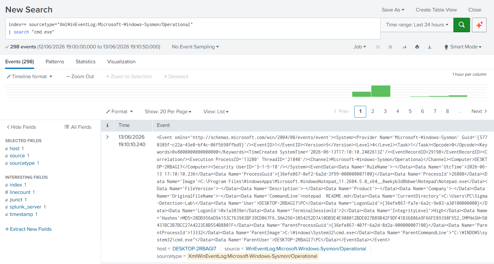

\# Sigma Detection Lab


\## Overview


This project demonstrates detection engineering using Sigma rules, Splunk SPL queries, Sysmon telemetry, and MITRE ATT\&CK mapping.


The goal of this lab is to create Sigma-style detections, convert them into Splunk SPL searches, and validate them using Windows Sysmon logs collected in Splunk.


\---


\## Environment


| Component | Details |

|----------|---------|

| SIEM | Splunk Enterprise 10.4 |

| Endpoint | Windows 11 |

| Telemetry | Sysmon |

| Log Source | Microsoft-Windows-Sysmon/Operational |

| Sourcetype | XmlWinEventLog:Microsoft-Windows-Sysmon/Operational |


\---


\## Detection Coverage


| Detection | MITRE ATT\&CK | Status |

|----------|--------------|--------|

| PowerShell Execution | T1059.001 | Completed |

| Command Prompt Execution | T1059.003 | Planned |

| Account Discovery | T1087 | Planned |

| Network Discovery | T1016 | Planned |

| File Creation Activity | T1105 | Planned |


\---


\## Detection 1: PowerShell Execution


\### Sigma Rule


```yaml

title: PowerShell Execution

id: sigma-powershell-execution

status: experimental

description: Detects PowerShell execution using Sysmon process creation telemetry.

logsource:

&#x20; product: windows

&#x20; service: sysmon

detection:

&#x20; selection:

&#x20;   Image|endswith: '\\powershell.exe'

&#x20; condition: selection

level: medium

tags:

&#x20; - attack.execution

&#x20; - attack.t1059.001

Splunk SPL Query
index=* sourcetype="XmlWinEventLog:Microsoft-Windows-Sysmon/Operational"
| search "powershell.exe"
MITRE ATT&CK

T1059.001 - PowerShell

Detection Result

PowerShell execution was detected in Splunk using Sysmon telemetry.

Skills Demonstrated
Sigma rule writing
Splunk SPL query development
Sysmon telemetry analysis
Detection engineering
MITRE ATT&CK mapping
Windows endpoint monitoring
SOC analyst workflow
Future Improvements
Add more Sigma rules
Convert Sigma detections into Splunk SPL
Add screenshots for each detection
Build a detection coverage matrix
Create alert logic based on Sigma rules

## Detection 2: Command Prompt Execution

### Sigma Rule

```yaml
title: Command Prompt Execution
id: sigma-cmd-execution
status: experimental
description: Detects execution of Windows Command Shell.
logsource:
  product: windows
  service: sysmon
detection:
  selection:
    Image|endswith: '\cmd.exe'
  condition: selection
level: medium
tags:
  - attack.execution
  - attack.t1059.003



title: Network Connections
logsource:
  product: windows
  service: sysmon
detection:
  selection:
    EventID: 3
  condition: selection

T1049

## Detection Coverage

| MITRE ATT&CK | Detection |
|--------------|-----------|
| T1059.001 | PowerShell Execution |
| T1059.003 | Command Prompt Execution |
| T1087 | Account Discovery |
| T1049 | Network Connections |
| T1105 | File Creation Activity |

